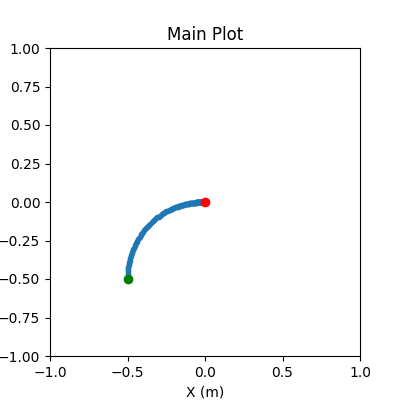
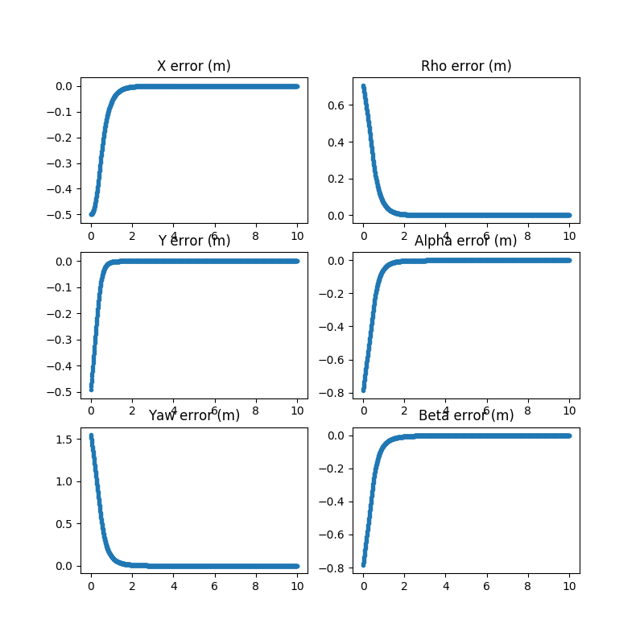

# Car Control
This package contains a collection of nodes that perform local control driving a
differential drive robot to a desired state.

The dd_control_node controller is based on the intuition
from https://cs.gmu.edu/~kosecka/cs485/lec04-control.pdf,
while the power_diagram_node is based on the paper: https://repository.upenn.edu/ese_papers/724/.

## C++ and ROS Usage

Example Launching the Controller Nodes:

    <!--Launch a DD Controller Node -->
    <group ns="$(arg ns)">
      <node name="dd_control_node" pkg="car_control" type="dd_control_node" output="screen"
      args="">
            <remap from="~odom" to="ground_truth/odom"/>
            <remap from="~commands" to="mobile_base/commands/velocity"/>
            <rosparam file="$(find dd_control)/config/dd_gains.yaml"/>
      </node>
    </group>

    <!--Launch a Power Diagram Node -->
    <group ns="$(arg ns)">
      <node name="dd_control_node" pkg="car_control" type="power_diagram_node" output="screen"
      args="">
            <remap from="~odom" to="ground_truth/odom"/>
            <remap from="~commands" to="mobile_base/commands/velocity"/>
            <rosparam file="$(find dd_control)/config/dd_gains.yaml"/>
      </node>
    </group>

## Python Usage

    cd script
    python3 dd_controller.py

