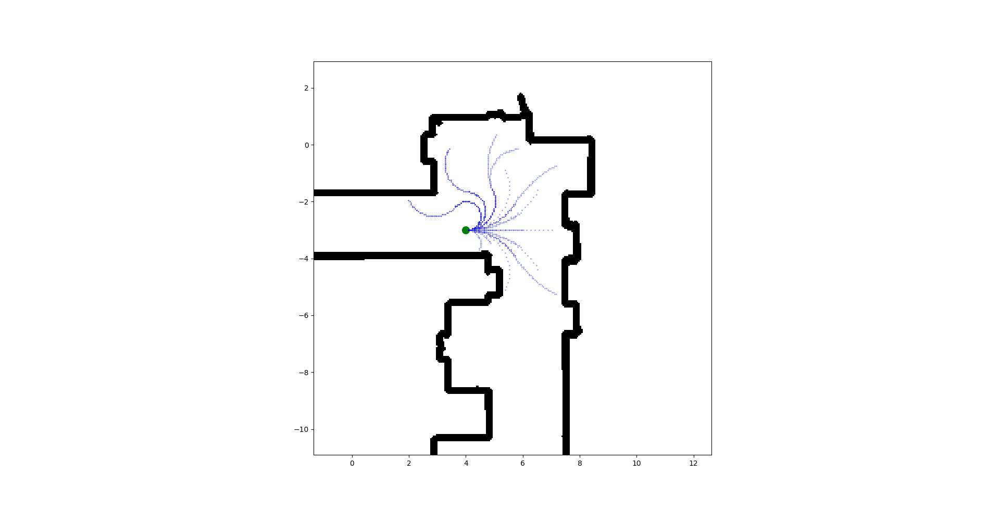
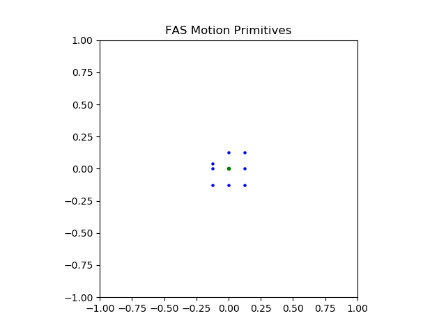

# Environments Package
This package contains code for several environments used in search-based planning for robotics. The environment is an abstract type that can efficiently compute the set of reachable successor states from a given initial state, subject to system dynamics with discretized control input (Motion Primitives) and with support for collision checking via a provided cost map. 
 
The package contains several environment types, each implementing a different system's dynamics for a set of control inputs. The current environments supported are:

- 2D Grid
- 3D Grid
- SE(2) / Differential Drive Motion Model

Included are examples of setting up environments in C++, and Python via Pybind11.

## Dependencies:
This package depends on:

- YAMLCPP
- Boost
- [erl_utilities](https://bitbucket.org/ExistentialRobotics/erl_utilities)

## Build Instructions:
The package can be built either with Catkin or pure CMake.

### Catkin Build Instructions (Default)
Prerequisite: An existing catkin workspace containing the erl_utilities package.

	cd ~/catkin_ws/src
	git clone git@bitbucket.org:ExistentialRobotics/erl_env.git
	catkin build

### CMake Build Instructions
From the project root directory:

	mkdir build
	cd build
	cmake .. -DUSE_ROS=OFF -DBUILD_TESTS=ON -DBUILD_PYTHON=ON
	make -j 8

## Running the Code:

### C++
The package is intended to be included by other packages, such as A* or Information Gathering planners. To run the tests for this package:

	cd erl_env
	mkdir build
	cd build
	cmake .. -DBUILD_TESTS=ON
	make test

To use this package in other projects, see the examples provided in [erl_astar](https://bitbucket.org/ExistentialRobotics/erl_astar)

### Python

To visualize the differential drive motion primitives in an SE(2) environment:

	python script/plot_mprim.py data/maps/large_map_se2.yaml

For the FAS environment:
	
	python script/plot_mprim_FAS.py

Changing the last argument will load a different map file.

The starting position is given in the Python script as:

    # Set Start coordinate for Plotting some Primitives
    start_m = [4, -3, 0]

And the motion primitives are defined in `data/mprim/mprim_SE2_combined.yaml`.
