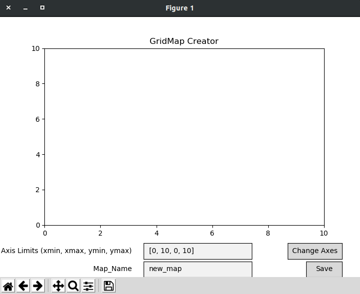
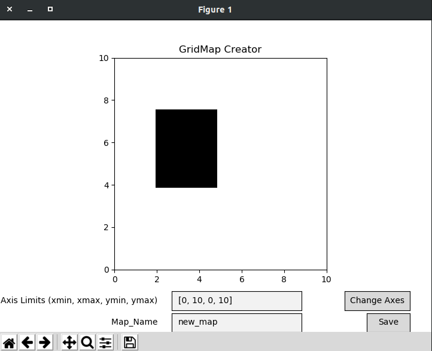

# The ERL Map package

This package contains the C++ source and associated Python bindings for the GridMap and MeshMap functionality
that is used throughout ERL code.

GridMaps are generic occupancy grid maps in 2 or 3 dimensions. MeshMaps are a collection of polygonal meshes.

## Predefined Maps
There exist a set of predefined 2D GridMaps that may be used in testing planning and estimation algorithms. 

Example loading of Obstacle Map:

    from py_map_data import obstacle_map  # Load the Obstacle Map
    
Note that here the map is loaded as a C++ GridMap object, so the C++ functions in `bindings` are useable.

## Creating a new Map

To use the map creation tool, run the following:

    from py_map_data import py_create_map
    py_create_map.main()
    

Then set the axis limits, before creating the obstacles.

Finally, once the axis limits are set, you can drag and drop rectangles.

    
## Loading a Custom new Map

After the map is saved, we can load it using the following:

    from py_map_data import py_maps
    py_maps.load_map('new_map')  # Assuming the created map is called 'new_map'
    
This will return a C++ GridMap object.